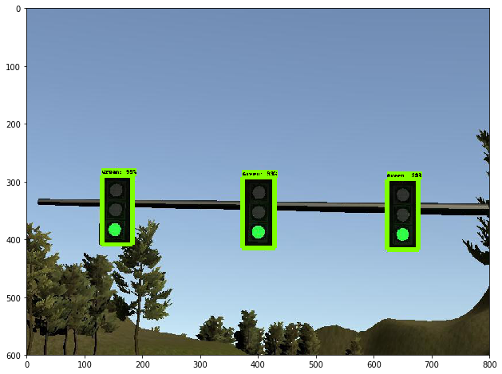

# Udacity Self Driving Car Nanodegree - Capstone Project

This is my individual submission to the _Capstone Project_. I want to get an all around general knowledge on the subject, so I did the project on my own. 

The submitter: Alper Kucukkomurler (Udacity e-mail: kucukkomurler.alper@gmail.com)

## Result

The car is able to navigate in the simulation track and successfully detect and stop at traffic lights.

[](https://youtu.be/prIGJmnVdkM)
(Clicking on the image will take you to the youtube video.)


## How to Use the Code

If you downloaded this repository from the udacity submission zip file. You can run the code directly by running
    cd ros
    roslaunch launch/styx.launch

If you cloned this repository, to test the code you need to download the [frozen trained models](TODO:insert google drive link here!) and extract them into "ros/src/tl_detector/light_classification/" directory. After that step 

## Traffic Light Detection and Recognition

For traffic light detection I choose an object detection with deep learning approach. Object detection networks have two parts, one for locating the objects of the image and one for classification of the located objects. The network can both locate the traffic light and classify its color in one step. So using the object detection networks elminiate the need for explicitly locating and classifying the traffic lights.

I used the Tensorflow's [Object Detection API](https://github.com/tensorflow/models/tree/master/research/object_detection). The object detection API has a [_Model Zoo_](https://github.com/tensorflow/models/blob/master/research/object_detection/g3doc/detection_model_zoo.md) where they have the state of the art, pre-trained object detection models.

Object detection requires data for training the models. Luckyily formet Self Driving Car Nanodegree students [Vatsal Srivastava](https://becominghuman.ai/@Vatsal410) and [Daniel Stang](https://medium.com/@WuStangDan) shared their datasets of [simulation] (https://github.com/coldKnight/TrafficLight_Detection-TensorFlowAPI) and real world (https://medium.com/@WuStangDan/step-by-step-tensorflow-object-detection-api-tutorial-part-2-converting-dataset-to-tfrecord-47f24be9248d) datasets.

There are many approaches to object detection and deep learning. Tensorflor [model Zoo](https://github.com/tensorflow/models/blob/master/research/object_detection/g3doc/detection_model_zoo.md) has an up-to-date repository of the state of the art object detection networks. The networks have different complexities (which affects the inference time) and they result in different precisions for object detection. For the traffic light detection I began with the fastest network using _SSD_ and _mobilenets_. However its precision was not enough so I switched a relatively more precise but still fast network using _faster RCNN_ and _inception_v2_ models. 

I trained (more appropriately, fine tuned) two models for simulation and real world data. The model trained with simumation data is located in "ros/src/tl_detector/light_classification/trained/sim/frozen" directory, and the model trained with real world data is located in "ros/src/tl_detector/light_classification/trained/real/frozen". The ros module reads the "is_site" parameter from "/traffic_light_config" and selects the correct model for the _simulation_ or _real world_ configurations. 

Some of the results of inference with the simulation object detector is below.





Some of the results of inference with the real world object detector is below. 


The training data of the simulation dataset has a bias toward red lights, when the light is distant. So the object detector classifies the distant traffic light as red. Although it does not affect the performance of the system greatly, since the car does't slow down much, when it is distant from the light, it slows down the car a bit. There is a room for improvement here. In the future updates I will extend the dataset and increase the performance of the classifier.

## Waypoint Updater

The waypoint updater reads the topics "/base_waypoints" and "/current_pose" considers the traffic conditions and publishes the waypoints to be followed by the car to "/final_waypoins topic". Waypoint updater is also notified, by the traffic light detection module, about the status of the incomming traffic light.

At each step, the car selects a number of waypoints beginning from the current position of the car and publishes those waypoints. For most of the part, the car follows the lane using the base waypoints. When the car encounters a traffic light, the waypoint updater calculates the location of the nearest traffic light and the stopping line before the light. Waypoint updater alters the forward waypoints in order to stop at the line before the traffic light.

For most of the code I followed the approach outlined by the walktroughs in the class. But there is room for improvement by obstacle avoidance by path planning.

## Drive by Wire

For the drive by wire module I took the approach outlined by the walktrough as well. This module builds on the path from the waypoint updater.The module has two controller components, one for steering and one for throttle. The steering is a linear model and throttle uses a PID controller.

This model also has room for improvement. It produces oscillations because of the PID type control. It can also be more optimized. I didn't have enough time to implement and tune a model predictive controller for the initial submission. In the next Updates I'm planning to use a model predictive controller that will greatly improve the performance.


### Rest of this file is the original README file from Udacity

This is the project repo for the final project of the Udacity Self-Driving Car Nanodegree: Programming a Real Self-Driving Car. For more information about the project, see the project introduction [here](https://classroom.udacity.com/nanodegrees/nd013/parts/6047fe34-d93c-4f50-8336-b70ef10cb4b2/modules/e1a23b06-329a-4684-a717-ad476f0d8dff/lessons/462c933d-9f24-42d3-8bdc-a08a5fc866e4/concepts/5ab4b122-83e6-436d-850f-9f4d26627fd9).

Please use **one** of the two installation options, either native **or** docker installation.

### Native Installation

* Be sure that your workstation is running Ubuntu 16.04 Xenial Xerus or Ubuntu 14.04 Trusty Tahir. [Ubuntu downloads can be found here](https://www.ubuntu.com/download/desktop).
* If using a Virtual Machine to install Ubuntu, use the following configuration as minimum:
  * 2 CPU
  * 2 GB system memory
  * 25 GB of free hard drive space

  The Udacity provided virtual machine has ROS and Dataspeed DBW already installed, so you can skip the next two steps if you are using this.

* Follow these instructions to install ROS
  * [ROS Kinetic](http://wiki.ros.org/kinetic/Installation/Ubuntu) if you have Ubuntu 16.04.
  * [ROS Indigo](http://wiki.ros.org/indigo/Installation/Ubuntu) if you have Ubuntu 14.04.
* [Dataspeed DBW](https://bitbucket.org/DataspeedInc/dbw_mkz_ros)
  * Use this option to install the SDK on a workstation that already has ROS installed: [One Line SDK Install (binary)](https://bitbucket.org/DataspeedInc/dbw_mkz_ros/src/81e63fcc335d7b64139d7482017d6a97b405e250/ROS_SETUP.md?fileviewer=file-view-default)
* Download the [Udacity Simulator](https://github.com/udacity/CarND-Capstone/releases).

### Docker Installation
[Install Docker](https://docs.docker.com/engine/installation/)

Build the docker container
```bash
docker build . -t capstone
```

Run the docker file
```bash
docker run -p 4567:4567 -v $PWD:/capstone -v /tmp/log:/root/.ros/ --rm -it capstone
```

### Port Forwarding
To set up port forwarding, please refer to the [instructions from term 2](https://classroom.udacity.com/nanodegrees/nd013/parts/40f38239-66b6-46ec-ae68-03afd8a601c8/modules/0949fca6-b379-42af-a919-ee50aa304e6a/lessons/f758c44c-5e40-4e01-93b5-1a82aa4e044f/concepts/16cf4a78-4fc7-49e1-8621-3450ca938b77)

### Usage

1. Clone the project repository
```bash
git clone https://github.com/udacity/CarND-Capstone.git
```

2. Install python dependencies
```bash
cd CarND-Capstone
pip install -r requirements.txt
```
3. Make and run styx
```bash
cd ros
catkin_make
source devel/setup.sh
roslaunch launch/styx.launch
```
4. Run the simulator

### Real world testing
1. Download [training bag](https://s3-us-west-1.amazonaws.com/udacity-selfdrivingcar/traffic_light_bag_file.zip) that was recorded on the Udacity self-driving car.
2. Unzip the file
```bash
unzip traffic_light_bag_file.zip
```
3. Play the bag file
```bash
rosbag play -l traffic_light_bag_file/traffic_light_training.bag
```
4. Launch your project in site mode
```bash
cd CarND-Capstone/ros
roslaunch launch/site.launch
```
5. Confirm that traffic light detection works on real life images
